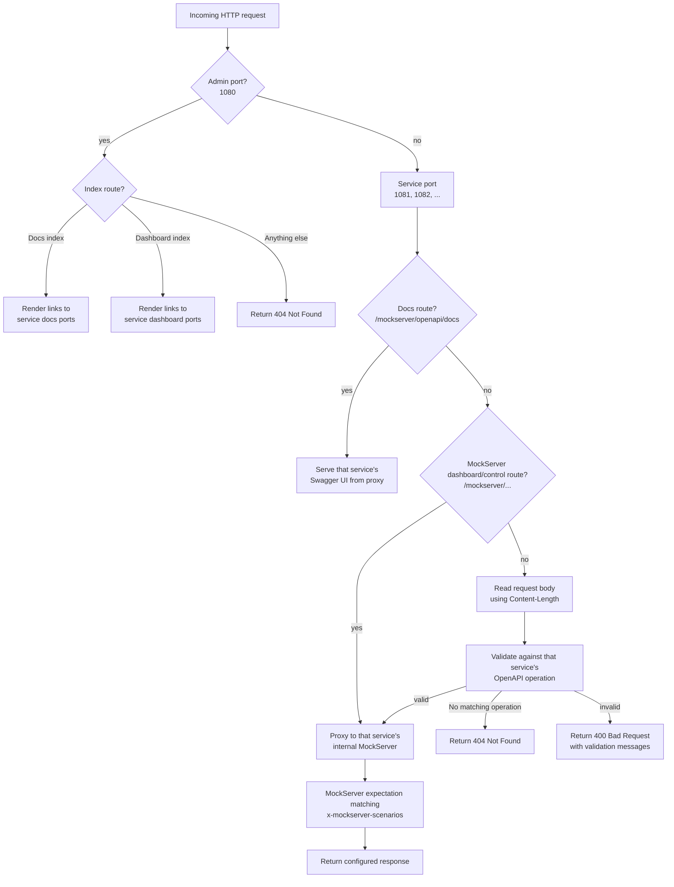

# mockserver-openapi-scenario-extension

A MockServer expectation initializer that turns OpenAPI `x-mockserver-scenarios` extensions into executable MockServer expectations at startup.

The extension lets an OpenAPI document act as both documentation and mock behavior. Response bodies, status codes, and content types stay in standard OpenAPI response examples. The custom extension only describes which example to use for a given request matcher.

## Requirements

- Java 17+
- MockServer 7.x
- OpenAPI 3.x YAML or JSON

## Extension Format

Each OpenAPI operation can define `x-mockserver-scenarios`:

```yaml
paths:
  /pets/{petId}:
    get:
      operationId: getPet
      responses:
        "200":
          description: Pet found
          content:
            application/json:
              examples:
                success:
                  value:
                    id: "123"
                    name: Luna
        "404":
          description: Pet not found
          content:
            application/json:
              examples:
                not-found:
                  value:
                    code: PET_NOT_FOUND
                    message: Pet was not found

      x-mockserver-scenarios:
        - matcher:
            pathParameters:
              petId:
                - "404"
          response: not-found

        - response: success
```

Each scenario has at most two fields:

- `matcher`: optional MockServer `httpRequest` matcher fields, except `method` and `path`.
- `response`: required OpenAPI response example name.

Generated fields:

- expectation id: `{operationId}-{response}`
- priority: derived from order, with earlier scenarios getting higher priority
- response status, content type, and body: derived from the referenced OpenAPI response example

Matcherless scenarios match only the OpenAPI method and path, so they must be last.

For OpenAPI templated paths such as `/pets/{petId}`, the extension adds wildcard path parameters to fallback scenarios so the OpenAPI path template still matches concrete requests.

## Build

```bash
./gradlew test
./gradlew runtimeJar
```

`runtimeJar` creates a Docker-friendly shaded jar:

```text
build/libs/mockserver-openapi-scenario-extension-all.jar
```

The shaded jar includes this extension's runtime dependencies but excludes MockServer itself, which is already present in the MockServer container.

## Docker Usage

Use the prebuilt GHCR image and mount one or more OpenAPI specs into `/config/openapi`.
Every `.yaml` and `.yml` file in that directory becomes a named mock service. The service
name is derived from the filename, so `accertify.yaml` becomes `accertify`.

```yaml
services:
  mockserver:
    image: ghcr.io/bilal-fazlani/mockserver-openapi-scenario-extension:<version>
    ports:
      - "1080:1080" # docs and dashboard indexes
      - "1081:1081" # accertify
      - "1082:1082" # worldpay
    environment:
      MOCKSERVER_OPENAPI_SCENARIOS_SPEC_DIR: /config/openapi
      MOCKSERVER_OPENAPI_SCENARIOS_SERVICE_PORTS: accertify=1081,worldpay=1082
    volumes:
      - ./mock-contracts:/config/openapi:ro
```

The Docker image serves a documentation index on the admin port:

```text
http://localhost:1080/mockserver/openapi/docs
```

Each service port is self-contained. For example, if `accertify.yaml` is mapped to port
`1081`, Accertify is available at:

```text
http://localhost:1081/{path-defined-by-accertify.yaml}
http://localhost:1081/mockserver/openapi/docs
http://localhost:1081/mockserver/dashboard
```

The service Swagger UI reads the same OpenAPI document used to create expectations,
expands the usual Swagger request and response documentation, and renders
`x-mockserver-scenarios` beside each operation. The renderer summarizes known matcher
shapes, such as body JSONPath matchers, without duplicating MockServer's matching engine
in the browser.

The Docker image also serves a dashboard index on the admin port:

```text
http://localhost:1080/mockserver/dashboard
```

Service dashboards live on their own service ports. A service dashboard shows only the
expectations generated for that service.

The Docker image validates incoming JSON request bodies for known OpenAPI operations before
proxying to MockServer. If the request body does not match the operation's OpenAPI request
schema, the proxy returns `400 Bad Request` with validation messages. If no OpenAPI
operation matches on that service port, the proxy returns `404 Not Found`. Dashboard and
docs routes bypass API schema validation.



The spec directory can also be provided as a Java system property:

```text
mockserver.openapi.scenarios.spec.dir=/config/openapi
```

Service ports are assigned by sorted filename starting at `1081` if
`MOCKSERVER_OPENAPI_SCENARIOS_SERVICE_PORTS` is not set. For stable local and CI
configuration, set explicit mappings:

```text
MOCKSERVER_OPENAPI_SCENARIOS_SERVICE_PORTS=accertify=1081,worldpay=1082
```

The same value can be provided as a Java system property:

```text
mockserver.openapi.scenarios.service.ports=accertify=1081,worldpay=1082
```

Docs settings:

```text
MOCKSERVER_OPENAPI_SCENARIOS_DOCS_PATH=/mockserver/openapi/docs
```

The published Docker image enables the docs UI by default.

The Docker image defaults MockServer logging to `WARN`. Set `MOCKSERVER_LOG_LEVEL=INFO` when you want MockServer's detailed request and expectation logs.

### Custom MockServer Image

If you need to build your own image, copy the runtime jar into MockServer's `/libs` directory and set the initializer class:

```dockerfile
FROM mockserver/mockserver:7.0.0

COPY build/libs/mockserver-openapi-scenario-extension-all.jar /libs/mockserver-openapi-scenario-extension.jar

ENV MOCKSERVER_INITIALIZATION_CLASS=com.bilal_fazlani.mockserver.openapi.scenario.OpenApiScenarioInitializer
ENV MOCKSERVER_OPENAPI_SCENARIOS_SPEC_DIR=/config/openapi
ENV MOCKSERVER_OPENAPI_SCENARIOS_DOCS_PATH=/mockserver/openapi/docs
ENV MOCKSERVER_LOG_LEVEL=WARN

HEALTHCHECK NONE

ENTRYPOINT ["java", "-Dfile.encoding=UTF-8", "-cp", "/mockserver-netty-jar-with-dependencies.jar:/libs/*", "-Dmockserver.propertyFile=/config/mockserver.properties", "com.bilal_fazlani.mockserver.openapi.scenario.OpenApiScenarioProxy"]
```

## Development

```bash
./gradlew test
./gradlew runtimeJar
docker build -t mockserver-openapi-scenario-extension:local .
```

The tests exercise scenario conversion without starting a MockServer process.

## Publishing

See [publishing.md](publishing.md).
